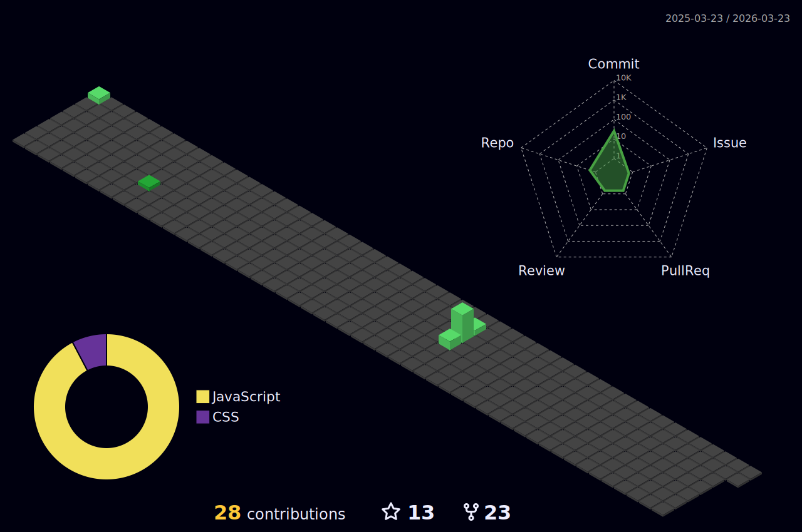

# mrCuber
# Hi there, I'm Umesh Chandra! 👋

Welcome to my GitHub profile! I'm passionate about coding and constantly exploring new technologies to create innovative solutions. Here's a bit about me:

- 💻 **Languages & Tools**: Proficient in **Java**, **C**, **JavaScript**, **Python**, and experienced with various frameworks and tools.
- 🌱 **Currently Learning**: Advancing my skills in **AI/ML** and **cloud computing**.
- 🛠️ **Projects**: I love working on open-source projects and contributing to the community.
- 📫 **How to Reach Me**: Feel free to connect with me on [LinkedIn](https://www.linkedin.com/in/umeshchandrasakinala/) or drop me an email at **umesh.sakinala20@gmail.com**.

<!-- ### Here's the languages that I am currently working on:

 -->

<!-- ### Connect with me 🤝

 -->

 

## Featured Repositories

- 🌟 **[Tracalorie]([https://github.com/MrCuber/Tracalorie])**: It is a javascript Project based on tracking the calories intake to our body, It utilizes the concept of OOPs and it is totally Object Oriented Programming.
- 🌟 **[Speech Emotion Recognition]([https://github.com/MrCuber/Speech-Emotion-Recognition])**:This project aims to harness the power of machine learning to detect and classify emotions from spoken language.
- 🌟 **[Product-Rating-and-Review-Platform]([https://github.com/MrCuber/Product-Rating-and-Review-Platform])**:Product Helpers enables users to submit detailed reviews and ratings for products.

## Latest Blog Posts

- 📝 **[Support Vector Machine(SVM) with Python](https://umeshchandra.in/2024/05/01/support-vector-machinesvm-with-python/)**: Steps to SVM using Python
- 📝 **[Understanding Support Vector Machines (SVM)](https://umeshchandra.in/2024/04/19/understanding-support-vector-machines-svm/)**: A beginner's guide to the SVM.

### My Badges

## Get In Touch

- 📧 Email: **umesh.sakinala20@gmail.com**
- 💼 LinkedIn: [Umesh Chandra](https://www.linkedin.com/in/umeshchandrasakinala/)
- 🐦 Twitter: [Umesh_S20](https://twitter.com/Umesh_S20)
- 🌐 Personal Website: [UmeshChandra](https://umeshchandra.in/)
Thanks for visiting my profile! Have a great day! 🚀

---

*Feel free to explore my repositories and get in touch if you have any questions or collaboration ideas!*

<!--  -->

<!--  -->
