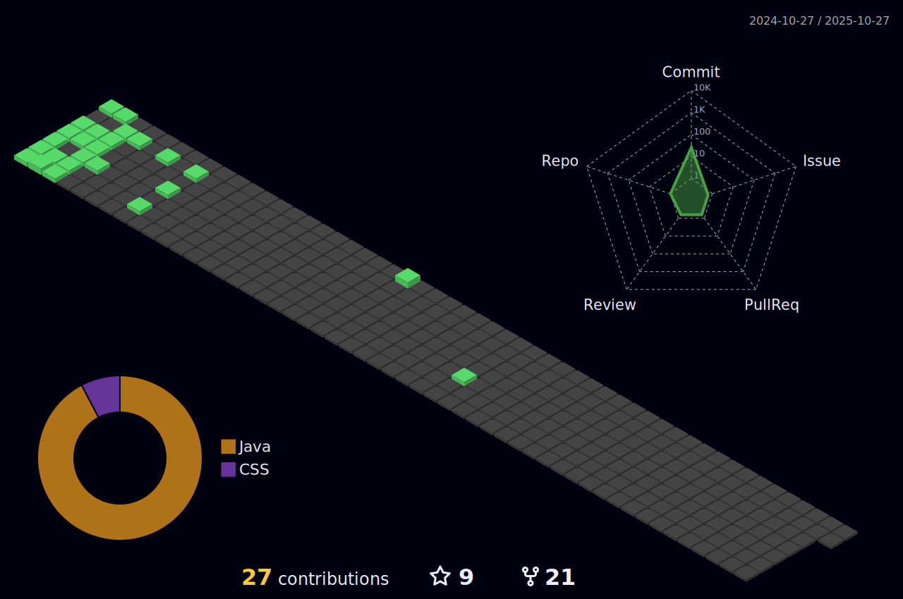

### Hey, I'm Umesh Chandra! 🤞

Iam a ~~Web Designer~~ Student with WEB designing and programming skills from VIT Chennai.

Since 2020 I've been living with Programming.

I'm always trying to grow and learn something new.
### I'm focusing on 💻

Currently improving my skills in: C#, MySQL. 
<!-- ### Here's the languages that I am currently working on:

 -->

### Find me 🌏

### My Badges

### Here's My GITHUB Stats
 
 

